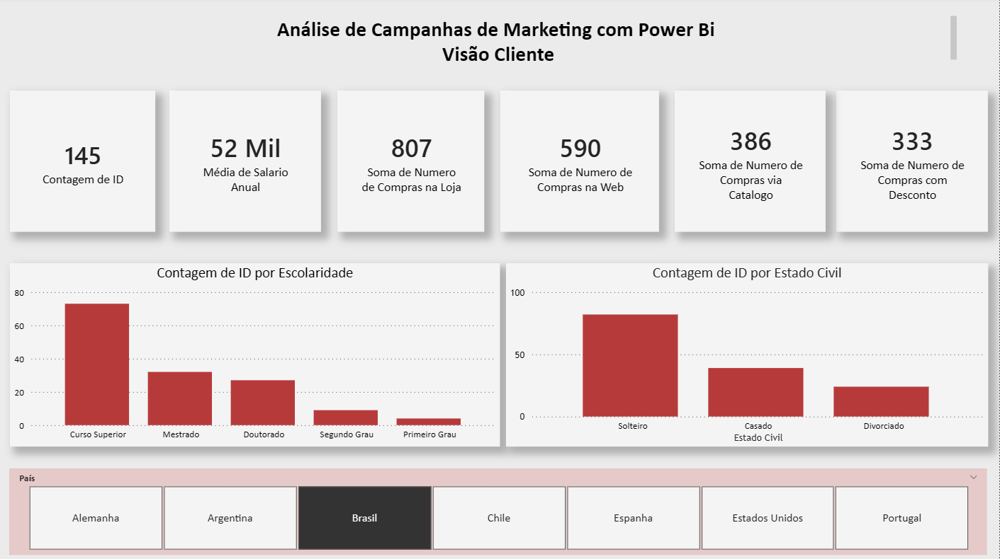
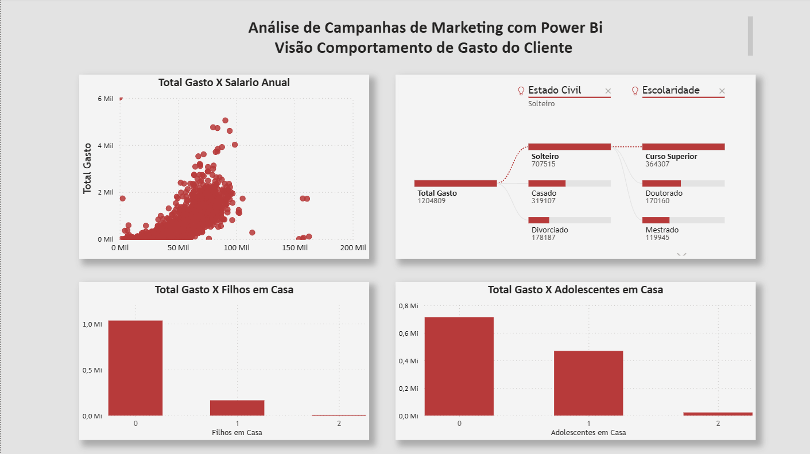
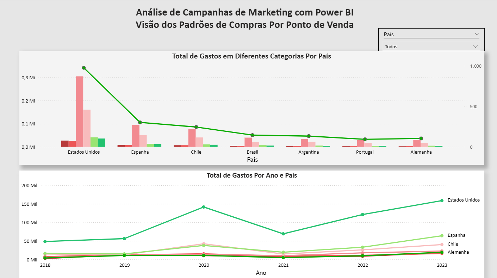
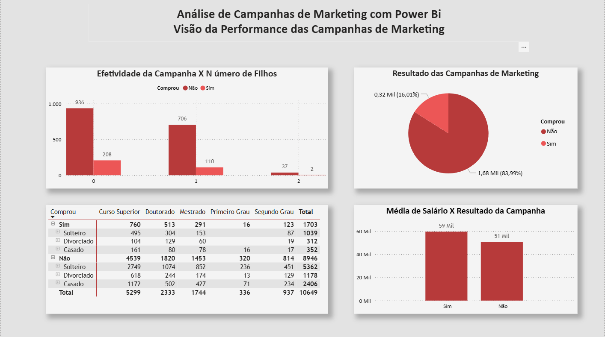

# Dashboard de Análise de Campanhas de Marketing

## Sobre o Projeto

Este projeto foi desenvolvido no Power BI com o objetivo de analisar o perfil dos clientes, seus padrões de consumo e o desempenho das campanhas de marketing.

Durante o desenvolvimento foram utilizados recursos como Power Query, segmentações, gráficos analíticos e diferentes visualizações para transformar dados em informações úteis para apoio à tomada de decisão.

## Visão Geral

Abaixo está a visão principal do dashboard:

## Estrutura do Dashboard

O dashboard foi organizado em diferentes páginas para facilitar a análise das campanhas de marketing sob diferentes perspectivas.

As análises estão divididas em:

- Visão Cliente.
- Visão Comportamento.
- Visão dos Padrões de Compras por Ponto de Venda.
- Visão da Performance das Campanhas de Marketing.

  ## Tecnologias Utilizadas

- Power BI Desktop.
- Power Query.
- Segmentações de Dados.
- Visualizações Analíticas.
- Gráfico de Dispersão.
- Árvore de Decomposição.

  ## Competências Demonstradas

Durante o desenvolvimento deste projeto foram aplicados conhecimentos relacionados a:

- Tratamento e transformação de dados utilizando Power Query.
- Construção de dashboards interativos.
- Análise do perfil e comportamento dos clientes.

  ## Principais Insights

Este dashboard permite identificar rapidamente:

- Perfil demográfico dos clientes, considerando escolaridade, estado civil e país.
- Relação entre renda anual e comportamento de consumo.
- Padrões de compra em diferentes países e pontos de venda.
- Tendências de gastos ao longo do tempo.
- Perfis de clientes com maior propensão a responder às campanhas de marketing.
- Indicadores que auxiliam na definição de estratégias de marketing mais eficientes.
- Exploração de padrões de consumo.
- Desenvolvimento de análises voltadas para campanhas de marketing.
- Organização das informações para apoio à tomada de decisão.

  ## Aprendizados

Durante este projeto foi possível aprofundar conhecimentos em:

- Construção de dashboards voltados para análise de marketing.
- Organização das análises em diferentes perspectivas de negócio.
- Utilização de recursos analíticos do Power BI para exploração dos dados.
- Interpretação do comportamento dos clientes por meio de visualizações interativas.
- Boas práticas de documentação e apresentação de projetos para portfólio.

  ## Contexto do Projeto

Este dashboard foi desenvolvido como parte das atividades práticas de um curso de Power BI.

A estrutura inicial foi utilizada como base de aprendizado. Entretanto, toda a organização do dashboard, documentação do projeto, estruturação do repositório e elaboração deste README foram desenvolvidas como parte do meu processo de aprendizado e construção de portfólio na área de Análise de Dados.

## Demonstração das Páginas

A seguir são apresentadas as principais páginas desenvolvidas no dashboard, cada uma voltada para uma etapa específica da análise de marketing.

### Visão Cliente

Apresenta uma visão geral do perfil dos clientes, incluindo informações demográficas, renda, escolaridade, estado civil e indicadores gerais relacionados ao público analisado.

---

### Visão Comportamento

Explora os padrões de consumo dos clientes, relacionando variáveis como renda, gastos, composição familiar e comportamento de compra.

---

### Visão Ponto de Venda

Apresenta a distribuição das vendas por país, ponto de venda e período, permitindo acompanhar tendências e comparar o desempenho das diferentes localidades.

---

### Visão Campanhas

Permite analisar o desempenho das campanhas de marketing e identificar o perfil dos clientes que responderam às ações promocionais.

